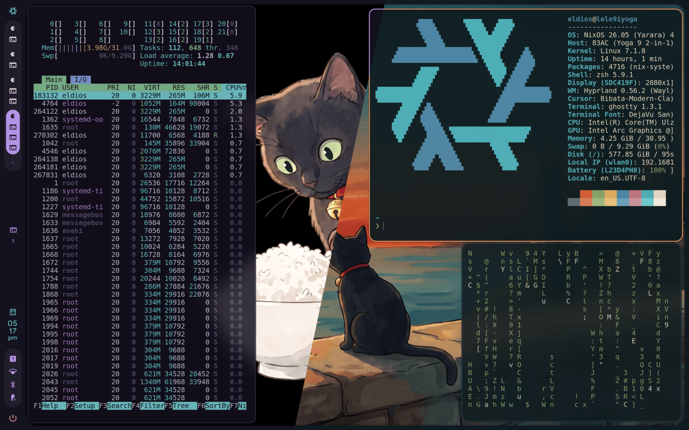
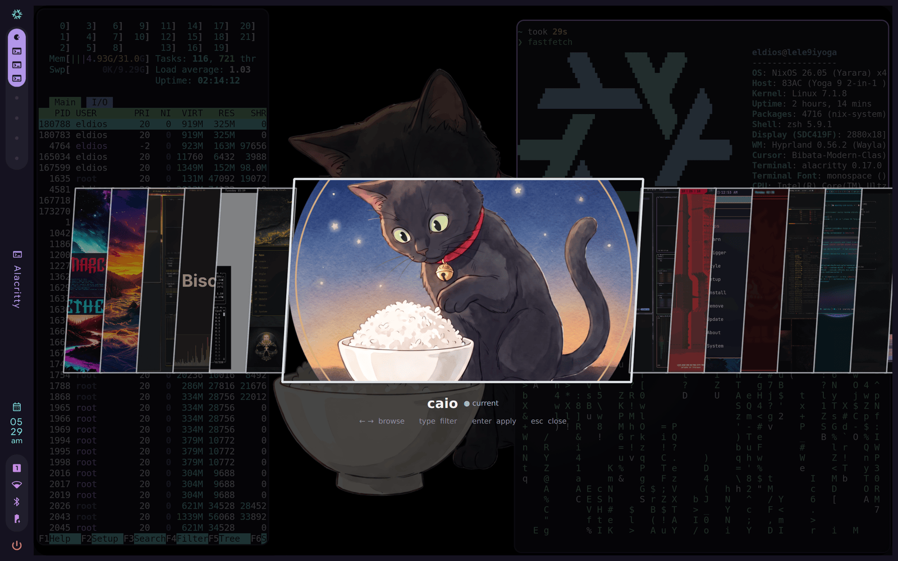

<div align="center">
  

### One palette, your whole desktop

A ricing framework for Linux: themes are data, riso renders them into
the files your desktop reads.

[](https://github.com/eldios/riso/actions/workflows/ci.yml)
[](https://github.com/eldios/riso/releases/latest)
[](https://aur.archlinux.org/packages/riso)
[](LICENSE)



<br><br>

<a href="#install"></a>&nbsp;
<a href="#quick-start"></a>&nbsp;
<a href="#commands"></a>&nbsp;
<a href="#how-a-theme-is-put-together"></a>&nbsp;
<a href="#themes"></a>&nbsp;
<a href="#cleanup"></a>

</div>

## Features

- One palette renders seventeen applications out of the box: terminals,
  bars, notifiers, lockers, editors
- Full-screen carousel (`--gui`) and terminal picker with image
  previews (`--tui`) for themes, wallpapers and the catalog
- Themes are data, never code: executables, run directives, symlinks
  and escaping paths are refused at install time
- Your configs stay yours: riso renders fragments your configs include,
  and `riso restore` puts back every byte it ever wrote over
- Hyprland, Sway, niri and Omarchy recognized from the session; reads
  Omarchy themes byte-for-byte compatibly
- Wallpapers per theme, remembered per theme
- One binary, a manpage, `git` and `curl` for fetching things

## Install

<details>
<summary><strong>Arch and the Arch family</strong></summary>

One AUR package serves the whole family:
[`riso`](https://aur.archlinux.org/packages/riso) builds from source
and verifies the PGP-signed release tag,
[`riso-bin`](https://aur.archlinux.org/packages/riso-bin) ships the
prebuilt binary. Each member has its own front door:

| Distro | Install | Worth knowing |
| --- | --- | --- |
| Arch | `paru -S riso` | any AUR helper works, `yay` included |
| Omarchy | `omarchy pkg add riso` | or the menu, Install > AUR; updates go through `omarchy update`, AUR packages included |
| EndeavourOS | `yay -S riso` | `yay` comes preinstalled |
| CachyOS | `paru -S riso` | `paru` comes preinstalled |
| Garuda | `paru -S riso` | update with `garuda-update --aur` |
| Manjaro | `pamac build riso` | enable AUR in pamac's preferences first; Manjaro's repos lag Arch and its team does not support the AUR |

Without a helper, clone and build:

```bash
git clone https://aur.archlinux.org/riso.git
cd riso && makepkg -si
```

> [!NOTE]
> The source package verifies the release tag against the maintainer
> key: `gpg --recv-keys AA6BC7743F8F9AD84BBA15C72CCBF4B71EFFDD46` once
> before the first build.

</details>

<details>
<summary><strong>NixOS</strong></summary>

Try it without installing anything:

```bash
nix run github:eldios/riso -- theme list
```

To keep it, add `github:eldios/riso` as a flake input and pull
`overlays.default` (or `packages.<system>.default`) into your NixOS or
home-manager configuration.

</details>

<details>
<summary><strong>Debian, Ubuntu, Mint</strong></summary>

Grab the `.deb` from the [latest release](https://github.com/eldios/riso/releases/latest)
and `sudo dpkg -i` it.

</details>

<details>
<summary><strong>Fedora, RHEL, openSUSE</strong></summary>

Grab the `.rpm` from the [latest release](https://github.com/eldios/riso/releases/latest)
and `sudo rpm -i` it.

</details>

<details>
<summary><strong>From source, if you must</strong></summary>

```bash
git clone https://github.com/eldios/riso.git
cd riso && cargo build --release
```

The binary lands in `target/release/riso`; the manpage is
`docs/riso.1`. On Arch, `cd packaging && makepkg -si` does the same
through the package manager.

</details>

## Quick start

```bash
riso theme install caio
riso theme set caio
riso backgrounds next
```

Themes come from anywhere, not only the catalog, and previews come
before choices:

```bash
riso theme install <git-url>
riso theme install --gui
riso theme set --tui
```

<div align="center">
  
</div>

## Commands

| Command | What it does |
| --- | --- |
| `riso theme install <name>\|<git-url>\|--gui` | from the catalog, from anywhere, or from previews |
| `riso theme set <name>` | apply a theme and tell the desktop |
| `riso theme set --gui\|--tui` | pick from previews: carousel or terminal |
| `riso theme get\|list` | what is applied, what is installed |
| `riso theme update` | bring installed themes up to date |
| `riso theme validate <path>` | is this safe to install |
| `riso backgrounds set\|next` | the wallpaper: which image... |
| `riso backgrounds mode\|get` | ...and how it scales |
| `riso plugin list` | what teaches riso about more applications |
| `riso dev palette\|render` | theme-author tools |
| `riso config` | the few persistent options |
| `riso config check` | can this system carry riso, and how to fix it |
| `riso restore` | put back what riso wrote over |
| `riso uninstall --yes` | put everything back and forget the state |

Every component has a single-letter alias (`riso t s` is `riso theme
set`, `backgrounds` also answers to `b`) and every command takes
`-o human|json|yaml`, so scripts read structure instead of parsing
prose. `riso(1)` has the options; the handful worth keeping live in
`~/.config/riso/config.toml`, managed by `riso config`.

## How a theme is put together

Four layers decide any given file, strongest first:

1. a file the theme ships by hand
2. a user template directory
3. a template directory the desktop provides
4. the templates compiled into `riso`

Layer 4 is what makes a theme impossible to leave incomplete; layer 1
is what lets an author overrule the generator on the file they care
about. Fonts are tokens like colours, so a theme carries its own
typography instead of leaving it to a setting somewhere else.

### Your configuration stays yours

`riso` renders fragments into its own tree and never rewrites an
application's config file. Your config, which belongs to you, includes
the fragment: mako's `include=`, waybar's `@import`, hyprlock's
`source`, a terminal's import directive. A theme change rewrites the
fragment; every rule you wrote around the include survives it, and
your own overrides can be included after the fragment so they win.

The one exception is a plugin, whose whole point is reaching a path the
application dictates. What was there first is copied aside for
`riso restore`, byte for byte, and the file opens with a comment saying
it is generated and where edits belong, in whatever comment syntax the
format speaks. A format with no comments, JSON above all, gets none.

### Safety

A theme is data and `riso` enforces it. Executable files, directives
that name a program to run, symlinks, and paths that climb out of the
theme directory are all refused, on the client as well as in the
catalog. A theme that arrives from a git URL never passed through a
catalog at all, which is exactly why the check runs twice.

## Themes

The [catalog](https://github.com/eldios/riso-themes) is a static index
pointing at ordinary git repositories, so publishing a theme needs no
account anywhere and installing one is a clone with a checksum.

| | |
| :---: | :---: |
| [](https://github.com/eldios/riso-theme-caio) | [](https://github.com/eldios/riso-theme-tuscany-sunset) |
| [`caio`](https://github.com/eldios/riso-theme-caio) | [`tuscany-sunset`](https://github.com/eldios/riso-theme-tuscany-sunset) |

## Extending

A plugin teaches `riso` to theme an application it does not know about:
a directory with a manifest and its templates, installed from git.

```toml
id = "eldios.zed"
api = 1
reload = ["zed", "--reload"]

[[render]]
template = "zed.json.tpl"
target = "~/.config/zed/themes/riso.json"
```

`riso` also reads themes written for
[Omarchy](https://github.com/basecamp/omarchy) and renders them
identically: the conformance suite resolves every palette that project
publishes byte for byte against its pipeline. A theme written for
either works on both. See [NOTICE](NOTICE).

## Develop

```bash
nix develop        # toolchain plus every tool the gates need
just ci            # format, lint, tests
just conformance   # the interoperability check
```

## Cleanup

Leaving is as safe as arriving. Put back every file `riso` wrote over,
or put everything back and forget the generated state too:

```bash
riso restore
riso uninstall --yes
```

Then remove the package with whatever installed it: `paru -Rns riso`,
`apt remove riso`, `dnf remove riso`, or drop the flake input.
